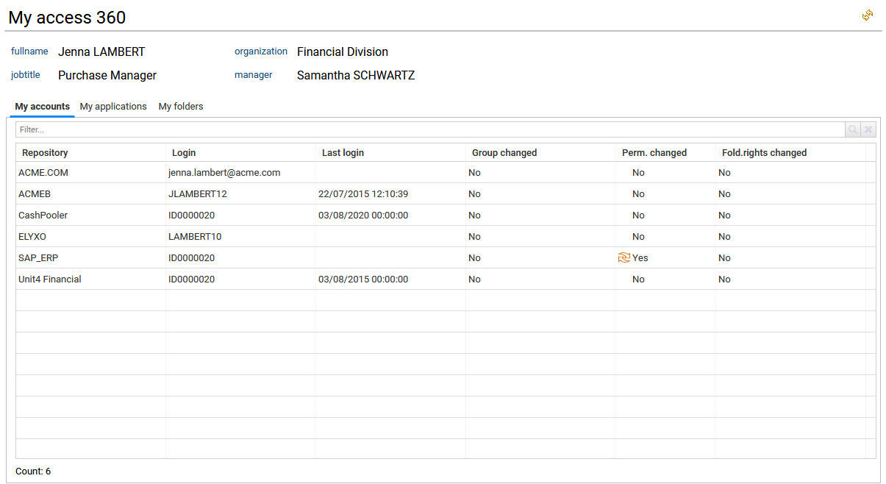
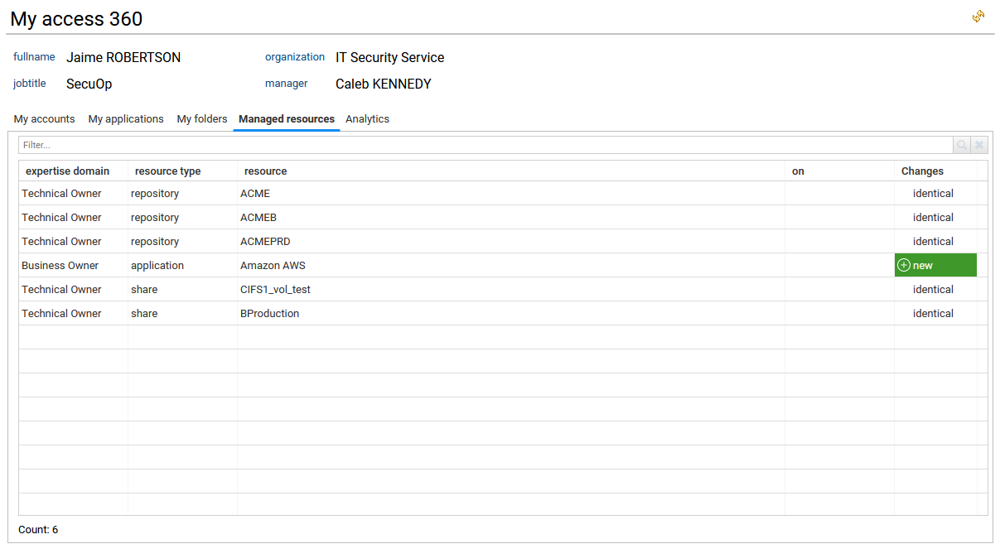
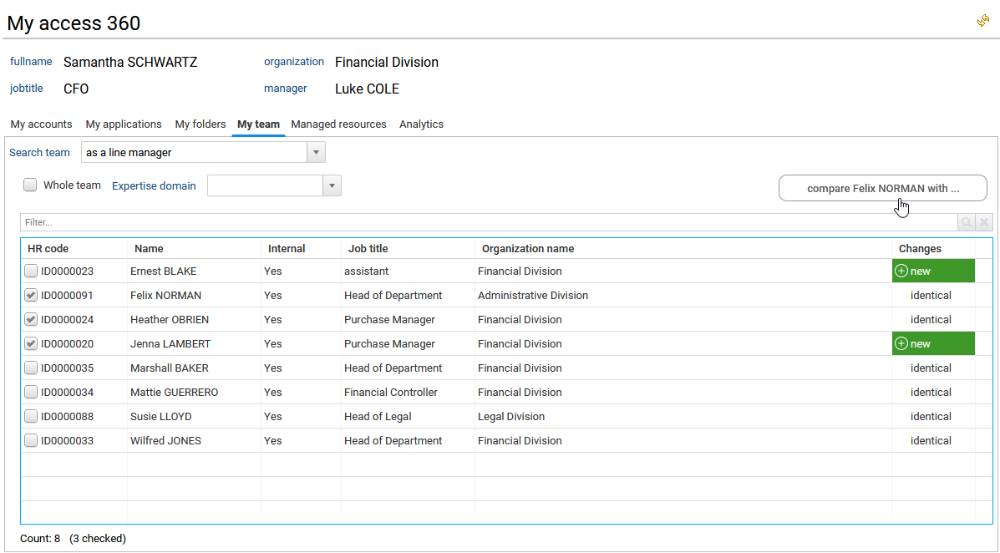

# Access 360

Access 360 is the first page the end-user see when he connects to the Identity Analytics portal. The objective of this page is to give him a quick overview of all the access information related to him, basically: who am I, my task list, and what can I access to. It also includes, when relevant, all information about resource management, when for exemple the end-user is an application owner, or an organisation manager, or a shared folder owner...

For end-users, Access360 will be the only accessible page. As a result, end-users DO NOT have access to search pages. Drill-down is only available through the main interface Access360 in order to enforce the least privilege principle.

So the left menu is empty, since only functional admins, technical admins and Review campaign managers will access to additional entries such as Search, Review, Settings and more. However, if mashup dashboards features have been activated, the end-user may find additional menu entries on the left. 

When tasks are assigned to any end-users, during an access review process for instance, he will find the list of related tasks with their submission date directly accessible in the first tab of Access360: **My tasks**. 

Depending on the scope of responsibilities of the end-user, the interface will present less or more information distributed in different tabs. Let's present each of them by responsibility type:

## For standard users  

For standard users, without any specific responsibility on resources and organizations consolidated in RadiantOne Identity Analytics, the Access360 interface will provide to the end-user an overview on its accounts, its applications and its folders.

- in the **My accounts** tab, the standard user will find the list of accounts he owns with indications of changes regarding group, permission and folder rights. These changes are evaluated during the data loading process by comparing the current situation with the previous timeslot. 

- in the **My applications** tab, the list of applications accessible by the connected standard user is listed in a first table. Selecting an application will then provide in a second table on the right the list of the related profiles/roles/permissions that gives the selected identity access to the application.  
The table on the right is configurable so that the end-user can add columns to display for example the sensitivity level and sensitivity reason of each permission. Please go to the [How to configure tables, columns and export data](#standard-tables) section to know more about table customization.

- in the **My folders** tab, the list of folder path and related rights (simplified ACLs) accessible by the connected standard user is provided. This tab is only available if the end-user has the appropriate licence (Booster for Data Governance/Unstructured Data).  
By default, only folders with direct ACLs are displayed, not the sub folders with inheritance. The end-user is able to check "Display only folders with ACLs" to get the full list of folders.
A Share family column is provided to list the type of unstructured data: SharedFolders (NTFS, CIFS), Microsoft365 (OneDrive, SharePointOnline, ExchangeOnline) and more.
In this tab, a filter is also provided through combobox to help the end-user select a specific share family and/or share and/or the folder depth requested.

## For resources owners  

Resources owners will find the same tabs as standard users with in addition a "Managed resources" tab and an Analytics tab.

- in the **Managed resources** tab, the resources owner can retrieve here the list of resources he owns, that could be of any type, such as Application, SharedFolders, Shares, Roles, Permissions, Accounts, Repositories, Groups and more.

Since he is the owner, by clicking on the resource or resource type, the resource owner can reach the related resource detail page to analyse and investigate accesses to them. See the [Detail pages](#detail-pages) section of this document for more details.

- in the **Analytics** tab, all the analytic reports available for the resources owner are available. Analytics can be simple reports as well as more elaborated management interfaces, and will be limited to the scope owned by the resources owner.

The full list of Analytics reports for any resources is available from the administration page and documented. Please go to section [Analytics reports](#how-to-list-all-the-available-analytics-reports-and-their-description) to know more.

## For organisation or/and line managers

Managers will get the same tabs as standard users with two additional: "My team" and "Analytics" tabs.  

- in the **My team** tab, the manager can access to the list of identities he is responsible for.
A combobox allows to select which team is expected, the one as an organisation manager or the one as a line manager.
A checkbox "Whole team" can be checked to list all the identities working in the sub departements/organisations.
When selecting "as a line manager", the end-user can also filter the list of identities per expertise domain.
He is also able to compare a selected identity in the team with one or more others selected in the same table. For more details on that, please reach the [how to compare identities, accounts, permissions or groups](#how-to-compare-identities-accounts-permissions-or-groups-with-each-others) section. 
The end-user can click also on the name or HRcode of an identity to open the related identity detail page to analyse and investigate accesses granted to them. See the [Identity details](#identities-details-page) section of this document for more details..  

- in the **Analytics** tab, all the analytic reports available for the organisation or line manager are available. Analytics can be simple reports as well as more elaborated management interfaces, and will be limited to the manager's scope of responsibilities.

The full list of Analytics reports for any resources is available from the administration page and documented. Please go to section [Analytics reports](#how-to-list-all-the-available-analytics-reports-and-their-description) to know more.
