# Campaign Examples

This chapter presents campaign configuration examples to cover the most common use cases.

## Review all access rights for some applications

This is the most common use case, in order to do so, you have to select the applications that you want to include in your access review campaign.

{ width=100% }

The default configuration will review **all** active accounts direct access rights (limited to permission type 'Role')

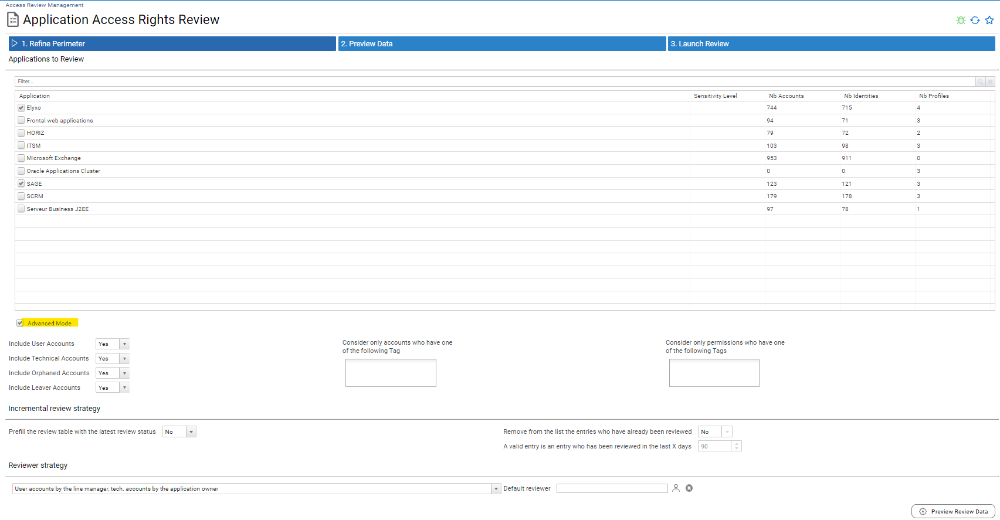{ width=100% }

The reviewer is either a **direct line manager** or an **application business owner**.
Each "user account" will be reviewed by the account owner direct line manager.
All the other accounts (technical accounts, orphan accounts, ...) will be reviewed by the application owner.

## Review all user accounts access rights per line manager

You can restrict your access review to user accounts only if you want to focus on *business line managers* as reviewers.
In order to do so you just have to select *user accounts* in the *Advanced Mode* section of the configuration page

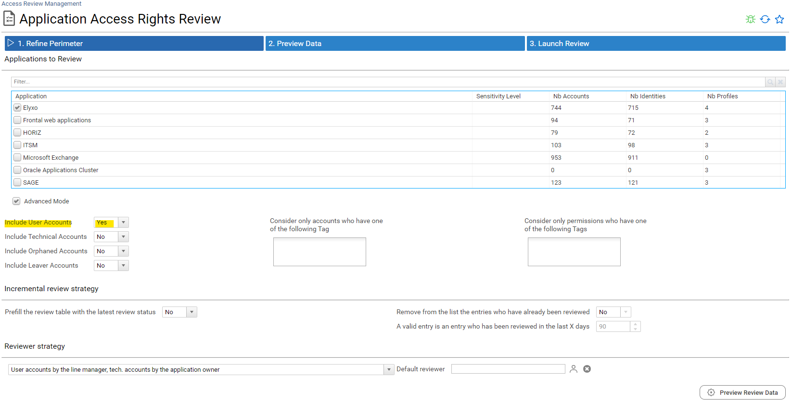{ width=100% }


## Self review of all dormant (unused) user accounts by the users themselves

You can pick *user accounts by themself* if you want the user reviewing themselves. This is very useful to review at-risk users or control defects such as outliers and unused access.

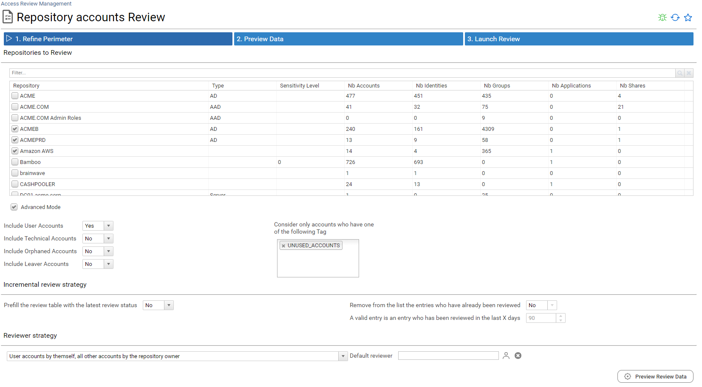{ width=100% }


## Review Finance departement access rights per line manager

It can be useful to restrict your access review to a given organisation, especially in large organisation.
Let's say for instance that you want to review SOX applications access rights in the *Finance Department*.

In order to do so, you will have first to tag all accounts belonging to people working for the *finance departement*.

> **Note** You can do it by performing an account search followed by a bulk tagging operation.

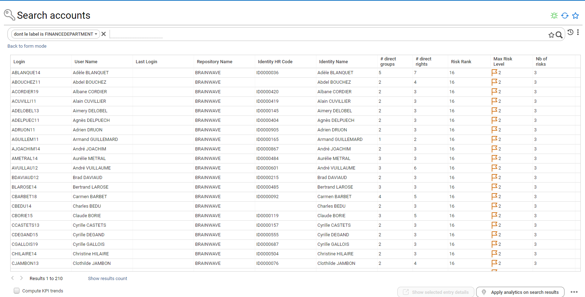{ width=100% }

Once done, you will have to select the account tag in the campaign configuration page.

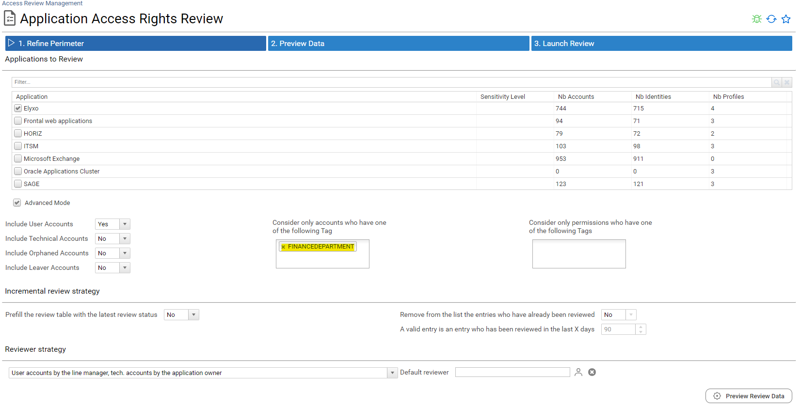{ width=100% }


## Review access rights of people who moved from one organisation to another

This use case is very similar to the previous one, you first have to tag the accounts you want to review with a search

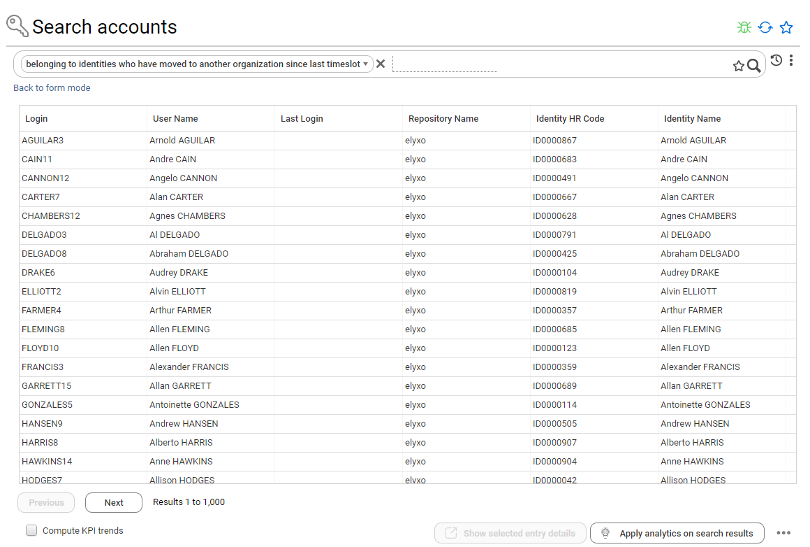{ width=100% }

Once done, you will have to select the account tag in the campaign configuration page.

## Review technical accounts access rights per application owner

In order to review technical accounts only, you just have to uncheck *Include User Accounts* in campaign configuration in the *Advanced Mode* section

{ width=100% }

> **Note** *Leavers* account correspond to active accounts belonging to people who are no longer part of the company. 

## Review sensitive access rights per application owner

In order to review sensitive access rights you first have to tag your sensitive permissions

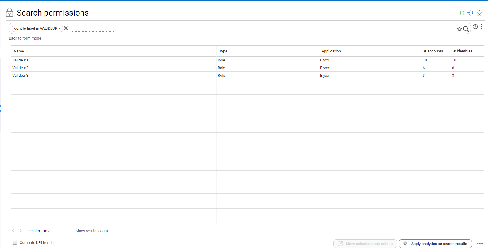{ width=100% }

Once this is done, you configure your access right campaign by

- Selecting the tag in the *Permissions Review Perimeter*
- Force the application owner to review everything

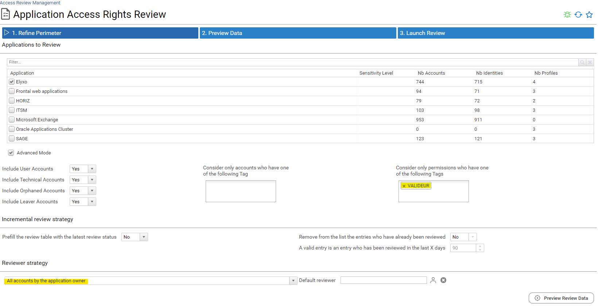{ width=100% }

## Review Only the changes since the last review

In order to review only the changes that occurred since the last review, you have to configure your *Incremental Review Strategy*

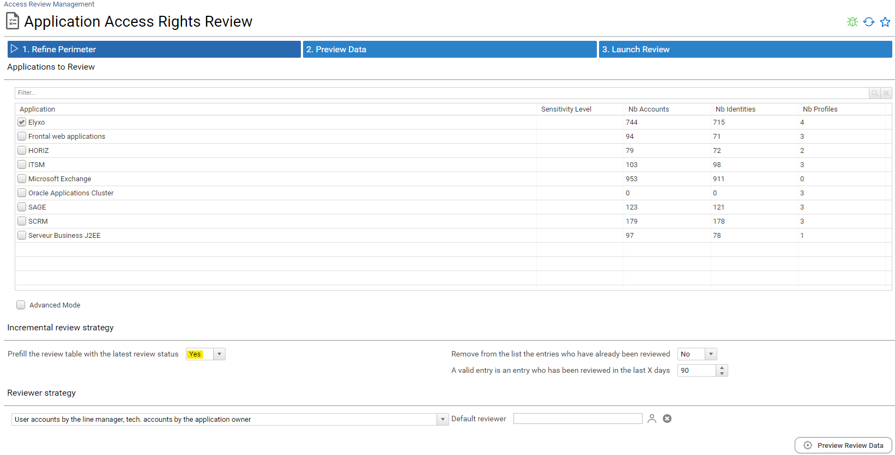{ width=100% }

Keep in mind that an entry will be considered as already been reviewed only if all those conditions are met:

- The entry has been reviewed in the configured timeframe (X days)
- For a user account, account owner characteristics have not changed (organisation, job title, internal status)

This will fulfill both the status and the comment columns in your review table. You can also simply remove those entries from the review perimeter by checking "Remove from the list entries who have already been reviewed"

## Review unused accounts access rights

In order to review unused accounts, you will have first to tag them through an account search leveraging a control result

{ width=100% }

Once this is done, you configure your access review and select the corresponding tag in *Accounts Review Perimeter*

## Repository accounts review

To launch an repository accounts review, select "Repository accounts Review" in the Access Review Management section. You have to select the repository that you want to include in your accounts review campaign.

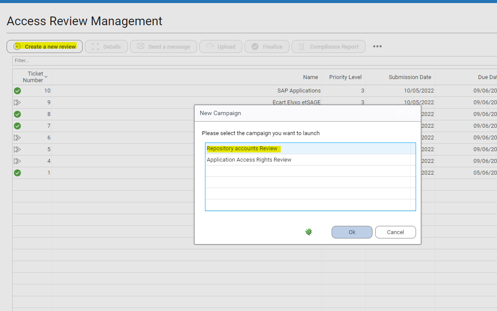{ width=100% }
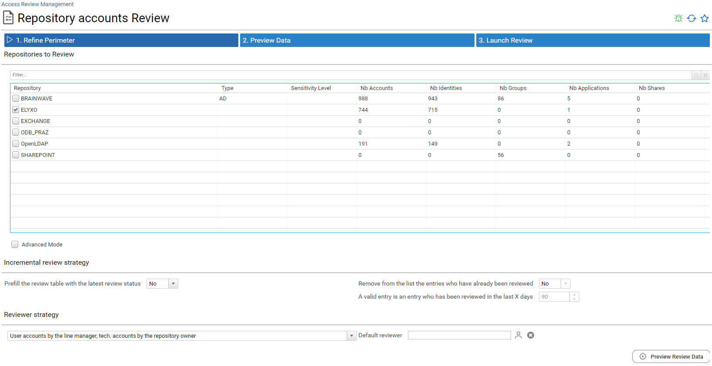{ width=100% }

The next steps are the same that application access rights review. Incremental review strategy and reviewers strategy must be defined. 

When the accounts review is launch, review is available on "Access 360" section:

{ width=100% }

Reviewers can start the accounts review. They can approve, revoke or comment one by one, they can also perform bulk operations by selecting several entries at once.

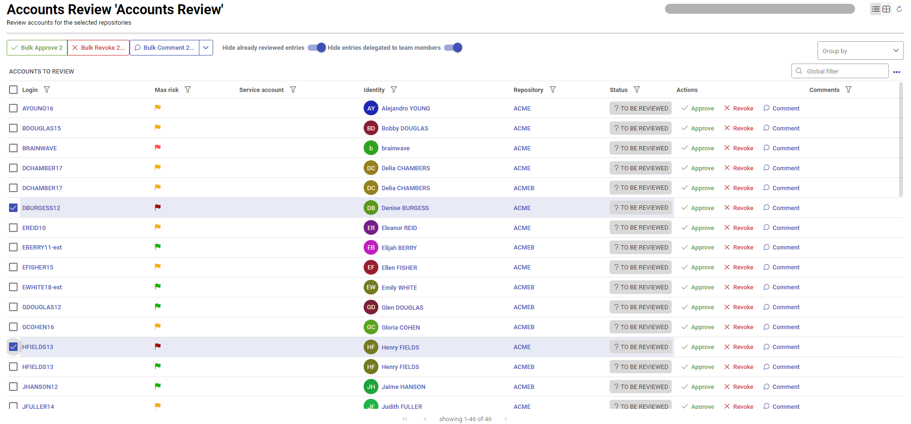{ width=100% }

## Sensitive service accounts by account owners, all other accounts by line manager or repository owner

You can configure more advanced scenarios where you can select who will have to do the review depending on some factors such as risk level, account sensitivity level, last login date, ...
In order to do this you have to enable the `advanced reviewer selection` mode

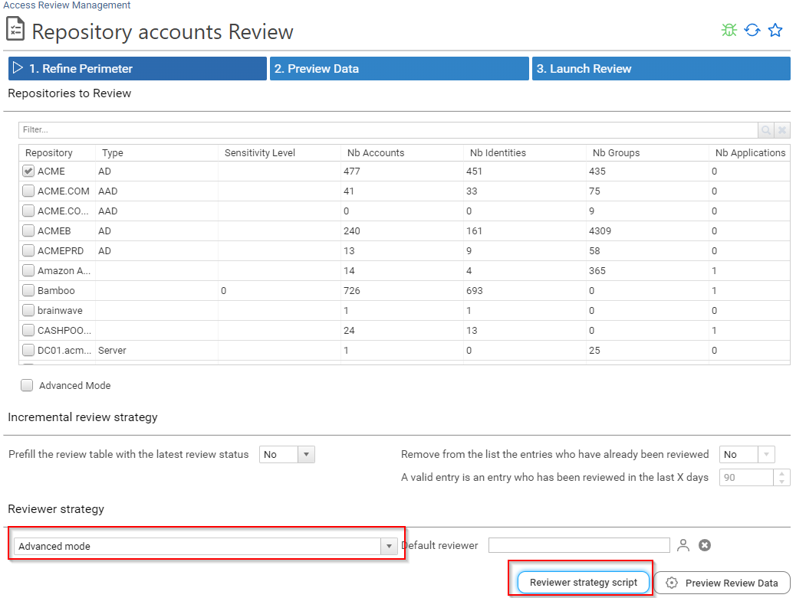{ width=100% }

Once done, you can define your strategy through a server side javascript.
This script will be executed for each individual line to review in order to find a valid reviewer. Here is an example.

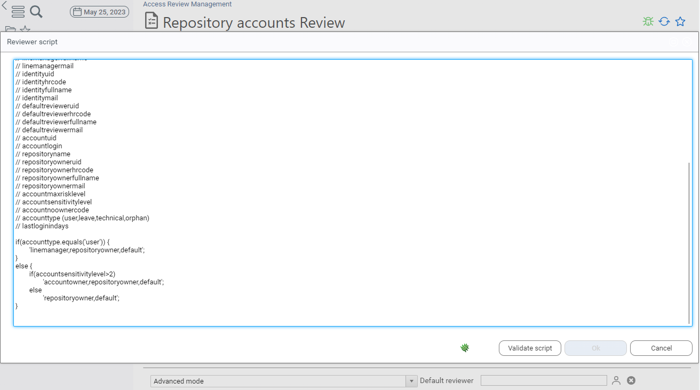{ width=100% }

```
// This script identifies the reviewer for each individual review line.

// You have to send back a value amongst the following:
// - linemanager
// - repositoryowner
// - accountowner
// - default
// - myself
// - HRCODE value
// You can also send back a list of values such as linemanager,accountowner,repositoryowner,default
// In this case, the first valid reviewer will be taken (valid = reviewer found + reviewer having an email)
// 
// 
// The following variables are fulfilled for your convenience:
// accountowneruid
// accountownerhrcode
// accountownerfullname
// accountownermail
// linemanageruid
// linemanagerhrcode
// linemanagerfullname
// linemanagermail
// identityuid
// identityhrcode
// identityfullname
// identitymail
// defaultrevieweruid
// defaultreviewerhrcode
// defaultreviewerfullname
// defaultreviewermail
// accountuid
// accountlogin
// repositoryname
// repositoryowneruid
// repositoryownerhrcode
// repositoryownerfullname
// repositoryownermail
// accountmaxrisklevel
// accountsensitivitylevel
// accountnoownercode
// accounttype (user,leave,technical,orphan)
// lastloginindays

if(accounttype.equals('user')) {
	'linemanager,repositoryowner,default';
}
else {
	if(accountsensitivitylevel>2)
		'accountowner,repositoryowner,default';
	else
		'repositoryowner,default';
}

```

This mode is disabled by default.
To enable this mode you have to edit the following feature file: `\webportal\features\bw_iasreview\iasreview.features`
The feature name is `iasr_accountreviewadvancedreviewermode`

## Sensitive permissions by permission owners, all other permissions by line manager or application owner

You can configure more advanced scenarios where you can select who will have to do the review depending on some factors such as risk level, account sensitivity level, last login date, ...
In order to do this you have to enable the `advanced reviewer selection` mode

{ width=100% }

Once done, you can define your strategy through a server side javascript.
This script will be executed for each individual line to review in order to find a valid reviewer. Here is an example.

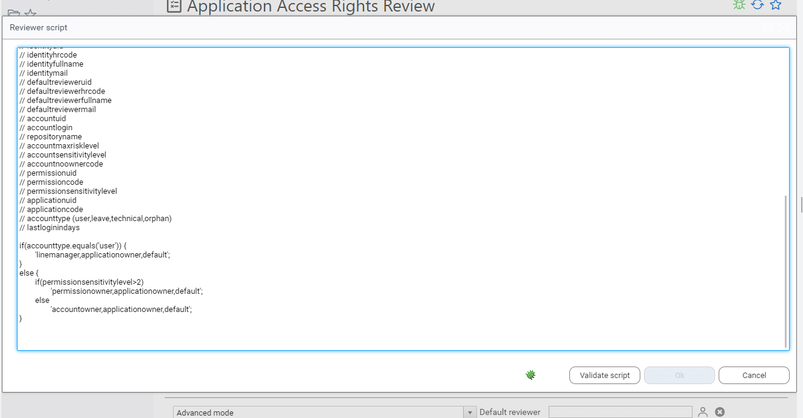{ width=100% }

```
// This script identifies the reviewer for each individual review line.

// You have to send back a value amongst the following:
// - linemanager
// - applicationowner
// - accountowner
// - permissionowner
// - default
// - myself
// - HRCODE value
// You can also send back a list of values such as linemanager,permissionowner,applicationowner,default
// In this case, the first valid reviewer will be taken (valid = reviewer found + reviewer having an email)
// 
// 
// The following variables are fulfilled for your convenience:
// applicationowneruid
// applicationownerhrcode
// applicationownerfullname
// applicationownermail
// permissionowneruid
// permissionownerhrcode
// permissionownerfullname
// permissionownermail
// accountowneruid
// accountownerhrcode
// accountownerfullname
// accountownermail
// linemanageruid
// linemanagerhrcode
// linemanagerfullname
// linemanagermail
// identityuid
// identityhrcode
// identityfullname
// identitymail
// defaultrevieweruid
// defaultreviewerhrcode
// defaultreviewerfullname
// defaultreviewermail
// accountuid
// accountlogin
// repositoryname
// accountmaxrisklevel
// accountsensitivitylevel
// accountnoownercode
// permissionuid
// permissioncode
// permissionsensitivitylevel
// applicationuid
// applicationcode
// accounttype (user,leave,technical,orphan)
// lastloginindays

if(accounttype.equals('user')) {
	'linemanager,applicationowner,default';
}
else {
	if(permissionsensitivitylevel>2)
		'permissionowner,applicationowner,default';
	else
		'applicationowner,default';
}

```

This mode is disabled by default.
To enable this mode you have to edit the following feature file: `\webportal\features\bw_iasreview\iasreview.features`
The feature name is `iasr_rightreviewadvandedreviewermode`