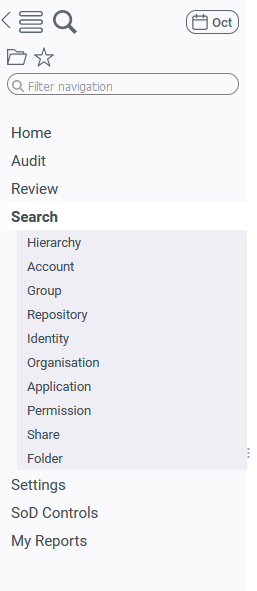
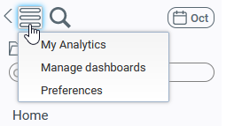
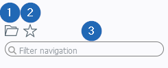
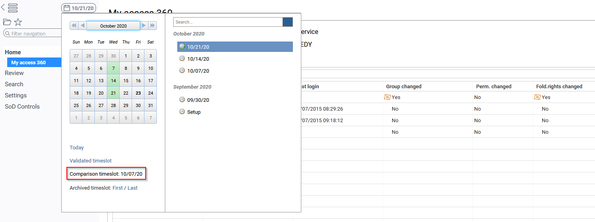

# Identity Analytics Enduser Guide

This document describes the basic principles of IAP (Identity Analytics Platform) interfaces and dashboards.

This documentation will only focus on Identity Analytics end user interfaces concepts and browsing, for details about installation and configuration, please refer to the IAP Integrator Guide.

For a more general introduction to RadiantOne Identity Analytics and the configuration of the solution, please refer to the full documentation, available using the following URL:
[https://developer.radiantlogic.com](https://developer.radiantlogic.com)

## General principles

Starting with Identity Analytics version Braille, the solution comes with a dedicated web experience called IAP (Identity Analytics Platform). The Identity Analytics Platform replaces the former webportal of Brainwave GRC. 

The main difference is that IAP comes with a series of off-the-shelf analytics/reports/controls/... to provide more value to the end-users.

IAP is also in an active development phase at RadiantLogic, thus by deploying IAP, not only the end user will benefit from a lot of off-the-shelf value, but he will also benefit of regular updates/improvements.

## Manifesto

IAP has been built with a set of general principles in mind, please find them below:

- **FAST:** results within 5 seconds, metadata powered
- **EFFICIENT:** All answers 3 clicks away
- **CONSISTENT:** Same navigation & presentation logic
- **SIMPLE** yet **POWERFUL**: Intuitive UX, rich analytics
- **RICH:** All concepts are leveraged, details are accessible when needed
- **TEMPORAL:** All UI include temporal analysis
- **SECURITY BY DESIGN:** You cannot see more than what is needed based on the your management responsibilities
- **EXTENSIBLE:** Easy to extend through 'Tags'

## General webportal navigation features  

This part aims at describing the general navigation principles of the Web Portal.  
By default, a header and menu bar on the left are provided to help the end-user browse through the information.  
Note that these header and menu bar have been probably customized to fit the branding colors and the logo of the end-user company.  
In addition, other specific menu categories and pages probably appear in the menu to meet some specific needs, or following the creation of new mashup dashboards by end-users.  
All screenshots in this document reflect the default display of the web portal and do not reflect the specificities or customizations that may have been implemented in your Identity Analytics project.  

### Header  

The header provides a QR code and URL generator to the current page (**1**). This allows the end-user to send directly the link to the report and dashboard he is displaying to stakeholders.
On the right side of the header, the name of the connected end-user appears (**2**).  

Clicking on the connected end-user name will provide an additional menu that allows to log out or access to the user preferences page.

### User preferences page

This page allows to change the preferred language (**1**) and other global preferences like choosing to display deleted items in all the "changes" columns of tables by default.  
To do so, from the User preferences page, the end-user can click on Global preferences (**2**) in the "Links" section and set "Include removed items in table trends" to yes.  
Please go to the [time navigation and changes](#time-navigation-and-changes) section for more information about changes.

In the same "Links" section, clicking on "My delegations" (**3**) will open the delegation management page. This page allows the end-user to delegate some of his roles for a given period to a colleague and to document the reason of this delegation.

### Top of pages options

On top of pages, a breadcrumb trail (**1**) represents the navigation path and gives the display context of the current page. On the right, an icon allows to refresh the page (**2**) when changes have been made in the displayed page, and a star icon (**3**) allows to add it to your favorite. When adding a page to your favorite, the related shortcut is then available from the menu bar in the list of favorites. See the next "Menu bar" section for more details.

### Menu bar  

On the left side, the menu bar allows to browse through the different pages available in the web portal.

On top of the menu bar, a first icon (**1**) allows to retract the menu bar to benefit from the full width of the web browser.  

 

A second icon (**2**) allows to open the option menu:  

  

This menu gives access to:  

- the "My Analytics" page that allows to create queries on any entities (identities, organisations, groups, permissions, shares, folders, repositories). This shortcut is visible for end-users having administrator or auditor roles only. See the section ["How to save search results and build your own report"](./04-search-pages#how-to-save-search-results-and-build-your-own-report) for more information about this page.
- the "Manage dashboards" page to manage the created mashup dashboards by the end-user or his colleagues. This is visible for end-users having administrator or auditor roles only.
- the "Preferences" dashboard, accessible by any user.

A third magnifier icon (**3**) provides a direct access to the "My Analytics" dashboard.  

A fourth icon (**4**) allows to navigate through the timeslots. Please check the next part ["Time navigation and changes"](#time-navigation-and-changes) for more details.  

Below these icons, other options are provided:

 

The folder icon (**1**), selected by default, gives access to the list of categories and pages from the menu bar.  
The star icon (**2**) allows to switch to the list of favorites (i.e. the list of pages the end user has added to his favorites).  
A search section (**3**) allows to filter the content of the menu bar: the pages list.

By default, all the end-users have access to the Home category, where they will find their Access360 home page named "My 360° Access". Please go to the [Access 360](./02-access360#access-360) section for more details.
When end-users have additional roles, such as designer, auditor or administrator, they may have access also to the following categories:  

- "Audit", and the page "My Analytics" to build queries and start creating dashboards (see above),
- "My Reports", which is an empty category also provided by default, to store mashup dashboards created by the end-user or shared by his colleagues.
- "Settings" that contains all the administration interfaces such as "Manage dashboards", "System" and the documentation.
- "Review" contains the review campaign management page and is available if you have the appropriate license.

### Time navigation and changes

All the tables provided in Access 360 and the Detail pages have a column named "changes" that list the status of the item in the selected timeslot (set of data upload) with regard to the comparison timeslot. The timeslot used for comparison is either the previous timeslot (by default), or the previous *reference timeslot* if references are used. This additional column indicates whether each entry has not changed with regard to the comparison date, is a new entry, or has been updated.  

The end-user can also display removed entries if needed, although this functionality is disabled by default to avoid any confusion. In order to activate 'removed entries', he has to edit his user preferences by clicking on his name->Preferences in the header on the upper right of the portal.  

As a general rule, it is very important to understand that comparison is done through:  

- element existence in the comparison timeslot
- sub-elements cardinality (if any) such as nb of perms, nb of groups, nb of accounts, nb of identities, ...

Comparison is NOT performed through a one by one attribute comparison, it means that for instance if an account attribute is updated (such as 'password never expires') it WON'T be displayed as updated.  

To check which timeslot is used for comparison, the end-user can open the timeslot selection dialog box (calendar) available on the upper left of the portal.  
Using this same interface, he is also able to go back on previous data uploads (timeslots) to analyze past situations, and some shortcuts are provided navigate easily through time: Today, Validated timeslot, and First/Last archived timeslot.  

Please refer to the [Comparison timeslot](./07-customization#how-to-configure-the-comparison-timeslot) section for more details about this feature and how to change the comparison timeslot.  

