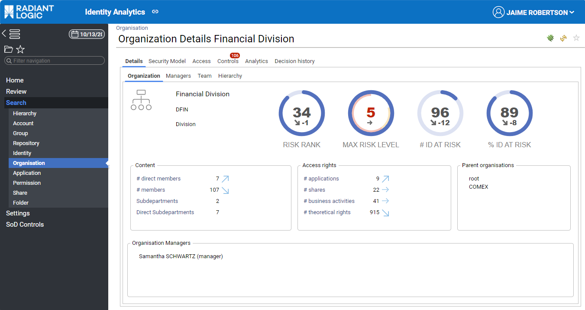
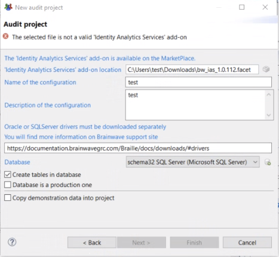
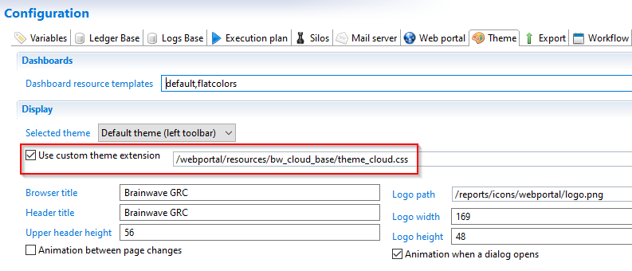

# Identity Analytics Integration Guide

This document describes the basic principles of IAP (Identity Analytics Platform) as well as the best practices to follow to fulfill the data & to configure the roles.

This documentation will only focus on IAP configuration, for a more general introduction to RadiantOne Identity Analytics and the configuration of the solution, please refer to the full documentation, available using the following URL:
[https://documentation.brainwavegrc.com](https://documentation.brainwavegrc.com)

## General principles

### Introduction

Starting with RadiantOne Identity Analytics version Braille, the solution comes with a dedicated web experience called IAP (Identity Analytics Platform). IAP replaces the former webportal. Although, legacy web portal configurations are still compatible with Braille, the preferred way to deploy the web user interface is now IAP.

The main difference with IAP is that it comes with a series of off-the-shelf analytics, reports, controls..., thus you no longer need to deploy add-ons on top of the default portal configuration to provide value to your customers.

IAP is also in an active development phase at RadiantLogic, thus by deploying IAP, not only you will benefit from a lot of off-the-shelf value, but you will also benefit of regular updates/improvements.

### Manifesto

IAP has been built with a set of general principles in mind, you will find them below:

**FAST**

results within 5 seconds, metadata powered

**EFFICIENT**

All answers 3 clicks away

**CONSISTENT**

Same navigation & presentation logic

**SIMPLE yet POWERFUL**

Intuitive UX, rich analytics

**RICH**

All concepts are leveraged, details are accessible when needed

**TEMPORAL**

All UI include temporal analysis

**SECURITY BY DESIGN**

You cannot see more than what is needed based on your management responsibilities

**EXTENSIBLE**

Easy to extend through Tags

## Setup

IAP is delivered as a dedicated add-on, available on the [marketplace](https://marketplace.brainwavegrc.com/package/bw_ias/).

You **MUST** download IAP prior to creating a new project. Once IAP is downloaded launch RadiantOne Identity Analytics and click on "new project", you will be able to select your IAP file add-on on the new Project Dialog Box.

As IAP is considered as a standard add-on, you will be able to upgrade it like any other add-on through the "facets" menu entry.

> [!warning] Starting with IAP 1.7, a modern look&feel is used in the interfaces.
> In order to activate this look&feel you **must** declare the corresponding CSS in your technical configuration
> 
