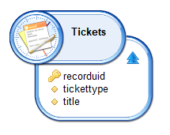

# Technical Corner

This chapter explains how access review are configured in RadiantOne Identity Analytics, technically speaking.  
This information is only useful if you have deployed Identity Analytics 'on-prem' and you want to leverage / extend access review.  

## Data model

### Review

When creating an access review campaign, all data to be reviewed (the review perimeter) is marked in the Identity Analytics  data model in the form of `ticketreview`.  
All those `ticketreviews` are attached to a `ticketlog` which represents the campaign.  

Information about the review campaign and the review status of each entry are written down in the tickets. `ticketreview` are updated on-the-fly every time a decision is taken. As a result, information in the Identity Ledger is a **real-time** view of the current campaign progress.  

Each entry to review is associated with a **(R)** esponsible and an **(A)** ccountable for the review. This is done through links from the `ticketreview` to the *accountable identity* and the *responsible identity*

Here is a `view` of an access right campaign.  

  

> As a campaign is launched manually, the `ticketlog` issuer is the one who launched the campaign. 

> When the campaign is initialized, the same reviewer information is assigned to the `ticketreview` as Accountable **and** Responsible. Responsible link is the one used to display entries to be reviewed by reviewers. When a reassignment occurs, only the *Responsible* link is updated, *Accountable* link never changes. As a result, you can spot reassigned entries by comparing accountableuid and responsibleuid (an entry is reassigned if they are different).  

Campaign information is stored as such:  

| Campaign     |                                            |
| ------------ | ------------------------------------------ |
| recorduid    | Campaign internal unique identifier        |
| ticketnumber | Campaign unique number                     |
| title        | Campaign name                              |
| description  | Campaign description                       |
| priority     | Campaign priority number                   |
| duedate      | Campaign due date                          |
| custom1      | Campaign type ('right', 'account')         |
| custom2      | timeslotuid when the campaign was launched |
| custom3      | status page                                |
| custom4      | review page                                |
| custom5      | finalize page                              |
| custom6      | offline mode enabled                       |
| custom7      | self delegation enabled                    |
| custom8      | is it a full (compliance driven ) review   |
| tickettype   | ADHOC_UAR                                  |

The campaign current status is stored in a dedicated metadata named `bwr_campaigninstance` where the subkey equals the campaign recorduid. The status is stored as a String in string3, the possible values are:

- init
- active
- pause
- finalizing
- closed
- cancelled

Review information is stored as such:

| Reviewed item |                                                                                                                                         |
| ------------- | --------------------------------------------------------------------------------------------------------------------------------------- |
| recorduid     | reviewed item internal unique identifier                                                                                                |
| status        | reviewed item status                                                                                                                    |
| comment       | reviewed item comment                                                                                                                   |
| actiondate    | reviewed item last action date                                                                                                          |
| custom1       | reviewed item printable label                                                                                                           |
| custom2       | in case of a user account, characteristics of the account owner in order to check for movements between reviews by comparing the values |
| custom3       | origin of the reviewer                                                                                                                  |
| custom4       | what is reviewed (account, right)                                                                                                       |

Review `status` value is one of the following value:

| review status  |                                                        |
| -------------- | ------------------------------------------------------ |
| ok             | Approved entry                                         |
| revoke         | Entry to be revoked                                    |
| update         | Entry to be updated                                    |
| reassign       | Entry marked as to be reassigned by the campaign owner |
| not reviewed   | Marked as not reviewed                                 |
| to be reviewed | Initial status: Entry needs to be reviewed             |

> Entries to review are marked as *to be reviewed* at the very beginning of the campaign; those are the entries displayed to the reviewers. Entries still not reviewed when the campaign is finalized can be marked as *not reviewed*

> *Reassign* is a special status used when a reviewer indicates that he considers himself as not being the correct reviewer for some entries. Those entries have to be reassigned by the campaign owner through the management interface.

`custom3` contains the origin of the reviewer. It can be:

| Reviewer origin (custom3) |                                                                             |
| ------------------------- | --------------------------------------------------------------------------- |
| linemanager               | The reviewer is the direct line manager of the account owner                |
| applicationowner          | The reviewer is the application owner                                       |
| permissionowner           | The reviewer is the permission owner                                        |
| accountowner              | The reviewer is the account owner                                           |
| groupowner                | The reviewer is the group owner                                             |
| repositoryowner           | The reviewer is the repository owner                                        |
| myself                    | The reviewer is the user himself                                            |
| default                   | The reviewer is the default reviewer (as configured during campaign launch) |

> [!warning] Although a reviewticket is not attached to a timeslot, the reviewed data is. As a result, you should be very cautious about the way you are designing your *views* as you can end up in situations where the lines won't appear because either the *Account* or the *Permission* no longer exists in the latest timeslot. If you want to display **all** this information whatever reviewed data still exists or not in the Identity Ledger, you should use *ticketreview displayname* instead of pointing to the access right.

### Finalized Review

As a `ticketlog` is a read-only information in the data model, another `ticketlog` had to be created in order to mark a review as *finalized*.

Ticketlog information is:  

| Finalized ticket log |                                                            |
| -------------------- | ---------------------------------------------------------- |
| recorduid            | Finalized ticketlog information internal unique identifier |
| title                | Review campaign internal unique identifier                 |
| tickettype           | ADHOC_UAR_COMPLIANCE                                       |

> `title` contains the review campaign `ticketlog` recorduid. As a result, if you want to check if a campaign is finalized you either have to create a *business view* and perform a join between those two ticketlogs with:
> `reviewticketlog.recorduid=finalizedticketlog.title`

> Finalized ticketlog contains the **compliance report**

> You can also detect if a review is finalized by checking the review campaign status metadata 

### Remediation

Once a campaign is finalized, remediation tickets are automatically created for all reviewed entries with `revoke` or `update` status.

A remediation is a `ticketlog`, nevertheless, as a ticketlog is read-only, a `ticketreview` is created for **each** remediation. This `ticketreview` contains the remediation current status.

Remediation information is stored in the remediation `reviewticket` as such

| Remediation ticket review |                                                                   |
| ------------------------- | ----------------------------------------------------------------- |
| recorduid                 | remediation internal unique identifier                            |
| status                    | remediation printable status                                      |
| comment                   | remediation comment                                               |
| actiondate                | remediation last action date                                      |
| custom1                   | remediation access right printable information                    |
| custom2                   | remediation closed status                                         |
| custom3                   | remediation type (embedded/itsm)                                  |
| custom4                   | timeslotuid when the last remediation ticket update has been made |
| custom5                   | External ticket number (displayable info)                         |
| custom6                   | External ticket id (internal info)                                |
| custom7                   | External ITSM instance code                                       |
| custom8                   | External ITSM hyperlink to show the ticket details                |

`status` contains the current review ticket status. This printable value depends on the remedation type (manuel, automated, ...) in case of an automated review through an ITSM system, this value contains the current ITSM ticket status.

`custom2` contains the remediation closed status. This information is managed by RadiantOne Identity Analytics and helps to identify whether this remediation is still active or closed.  

> You cannot rely on `status` to check for the active remediation state as `status` contains a printable status which depends on the remediation type

| Remediation closed status |                                              |
| ------------------------- | -------------------------------------------- |
| -1                        | Remediation is ready to be launched          |
| 0                         | Remediation is still active                  |
| 1                         | Remediation is closed and has been done      |
| 2                         | Remediation is closed and has been cancelled |

As you can notice in the upper table, the only case where a remediation has been done is when `custom2=1`

`custom3` contains the remediation type, it can be

| Remediation type |                                                                                                                                                                   |
| ---------------- | ----------------------------------------------------------------------------------------------------------------------------------------------------------------- |
| embedded         | Manual remediation through RadiantOne Identity Analytics                                                                                                          |
| itsm             | Managed remediation through an ITSM system, as several ITSM can be declared in Identity Analytics,   `custom7` contains the Identity Analytics ITSM instanceid |

> **Important Note** A *remediation ticketreview* is **not** associated with the access right which needs to be remediated. It is associated with a *dummy* reviewed metadata. When configured this way, this ticketreview will never diseapear even when the access right itself diseapear when refreshing the Identity Ledger. A printable version of the access right is available in `custom1`.

## create / update review status

Several workflows are available to create/update reviews. You should use them whenever possible. Those workflows are located in `/workflow/bw_access360/`

| Workflows                               |                                                                                                    |
| --------------------------------------- | -------------------------------------------------------------------------------------------------- |
| assignAccessRightsReviewTickets         | Used to initialize an access rights review campaign                                                |
| deleteCampaign                          | Used to delete **all** tickets associated with a campaign, including remediation                   |
| writeAccessRightsReviewTickets          | Used to update campaign entries review status                                                      |
| reassignAccessRightsReviewTickets       | Used to reassign some review entries to another Responsible Identity                               |
| resetDelegationAccessRightReviewTickets | Used to reset the reassignment of review tickets by copying accountable entry to responsible entry |
| finalizeAccessRightsReview              | Used to finalize an access rights review campaign, including generating the compliance report      |
| createRemediationTickets                | Used to initialize remediations by creating a series of remediations associated to reviewticket    |
| createRemediationTicket                 | Used to create one remediation ticket                                                              |
| writeRemediationTickets                 | Used to update remediation tickets status                                                          |

## launch remediation  and create ITSM tickets / refresh ITSM tickets status

Several workflows are available to automatically create/update remediations. You can launch them through a scheduled batch (`igrc_workflow.[cmd|sh]`) if you want automate remediation creation or ITSM tickets refresh. Those workflows are located in `/workflow/bw_iasreview/`

| Workflows                           |                                                              |
| ----------------------------------- | ------------------------------------------------------------ |
| inittickets (bwr_inittickets)       | Used to automatically launch all "pending" remediations.     |
| refreshtickets (bwr_refreshtickets) | Used to automatically refresh all active ITSM tickets status |

## Self-Reassignment

Self-reassignment is disabled by default, if you want to enable it for the reviewers you **must** update the security configuration of your project.
Self-reassignment is protected by a feature named `iasreview_selfmanagement` found in `\webportal\features\bw_access360\enduser360.features`

In order to enable it you should assign this feature to `enduser360` featureset

